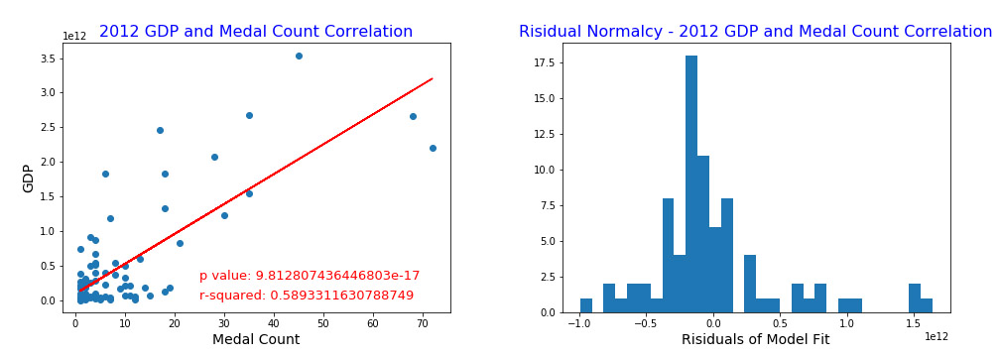
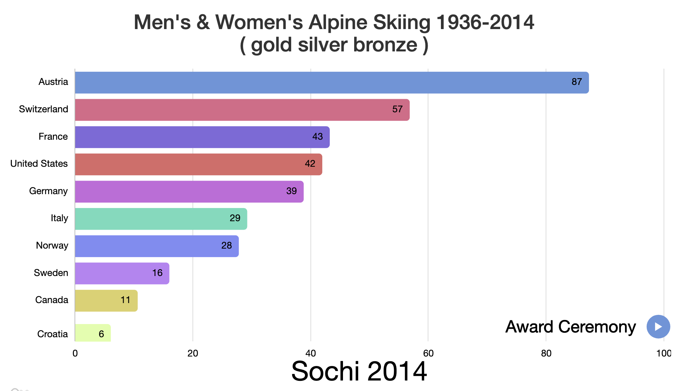
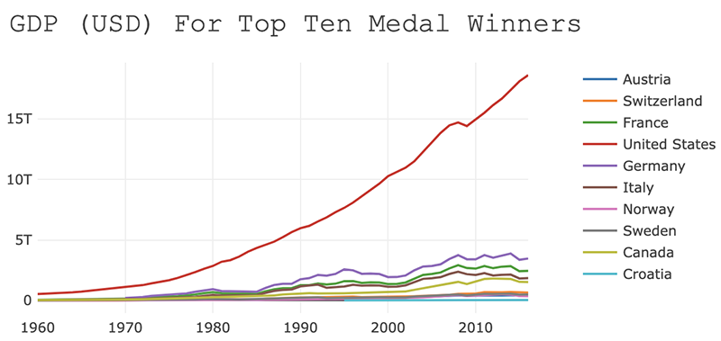
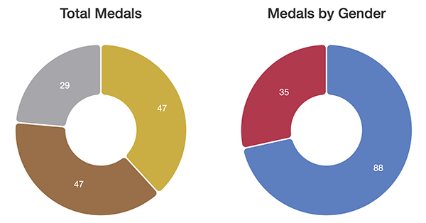

# Olympics Dashboard

## Description 

This dashboard encourages users to dynamically explore top medal-winning countries for an individual sport or overall Olympic, while also examining correlation between GDP.

## Table of Contents
* [Correlation](#Correlation)
* [Run](#Run)
* [Tools](#Tools)
* [Graphs](#Graphs)
* [Data](#Data)

## Correlation

Although I found an initial correlation between GDP and medal total per country, I wasn't confident in the results as USA so heavily skewed the model, with its GDP dwarfing that of most other countries combined. 

So, I used the GDP z-score to remove outliers beyound two standard deviations and reworked the model. This time I felt more confident as I still found a correlation. To further verify a significant result, I looked at the residual normalcy to ensure it was a good fit. 

There are certainly other confounders, but there does appear to be a connection between GDP and medals won. This is logical as countries with more money have more resources to train.

## Run

The below link takes you to the app, running on Heroku:

[Olympic Dashboard app](https://olympic-dashboard.herokuapp.com/)

## Tools

SQL, Matplotlib, JavaScript, Plotly.js, D3, Bootstrap, HTML5, CSS, Flask, Python

## Graphs

Using the Amchart JS Library as a foundation (which had to be heavily modified to work with the data set) shows accumalitive medals won over time. To reflect the competative nature of the Olympics, and to encourage user exploration, I created a race bar chart that shows the top ten countries at any one point. As a new country enters the top ten, it knocks another one out.

Once the bar chart race ends, a line graph pops up showing the GDP for the top ten winners.

The user can further explore by year and see breakdowns by medal-type, gender, population, and host city.

## Data

The data was pulled from various sources including [Kaggle](https://www.kaggle.com/rio2016/olympic-games) and required extensive cleaning which I did in in PostgreSQL.

The Olympics use their own IOC, three digit country code which required modifying to allow for merging with our GDP data set. 

We had to research how medals are counted for counteries such as Soviet Union/Russia, East and West Germany,  and other countries that have gone through major shifts. (Russia claims the medals won as the Soviet Union, but the Olympic committee counts them as different. For our purposes we decided to merge the medal count.)

The chart included the 1906 Intercalated Games which at one point was considered the olympics, but is no longer considered as such (Wikipedia), so we eliminated it from the data set.

